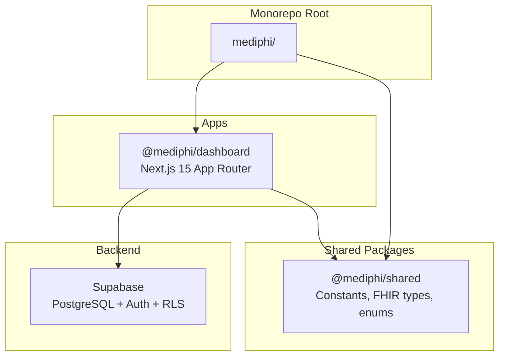
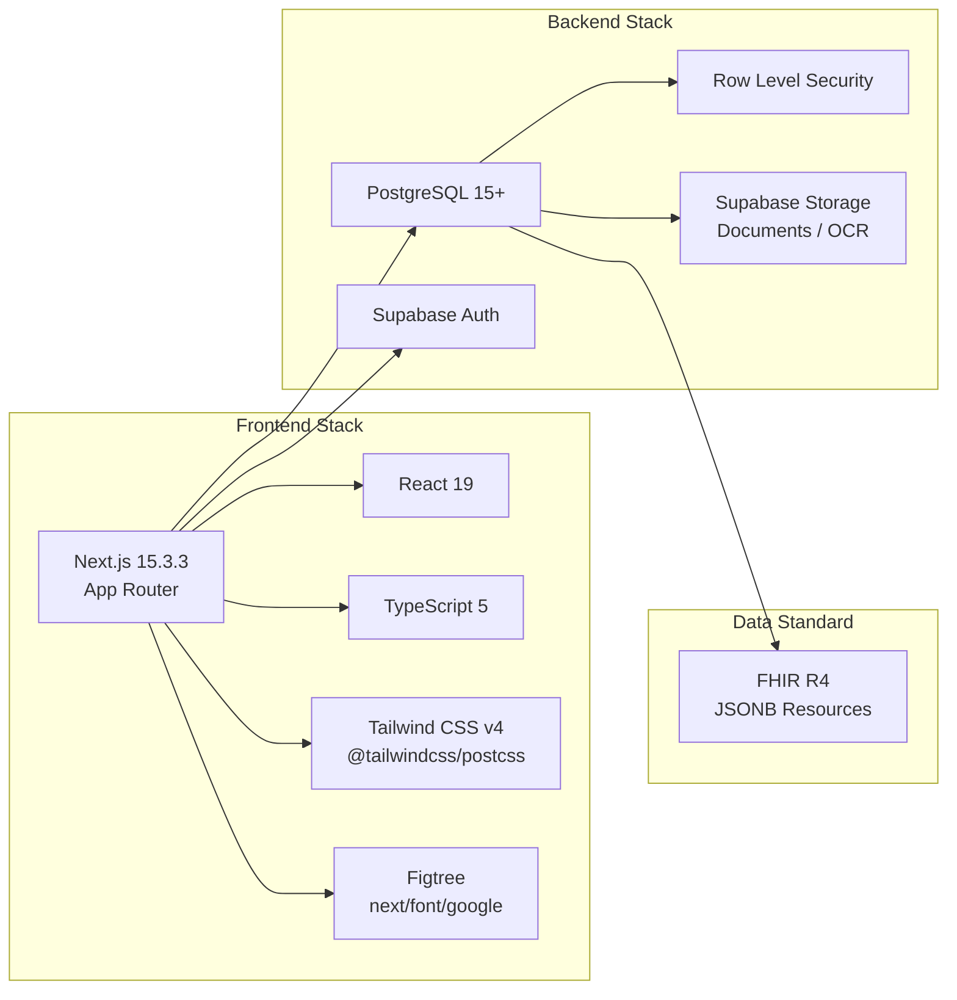
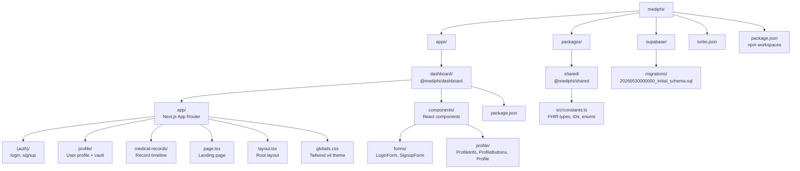
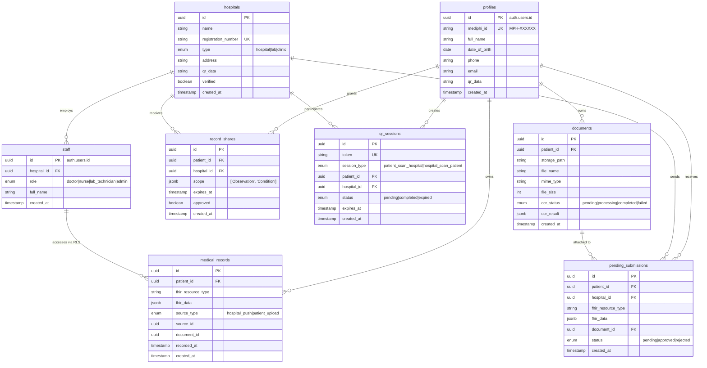
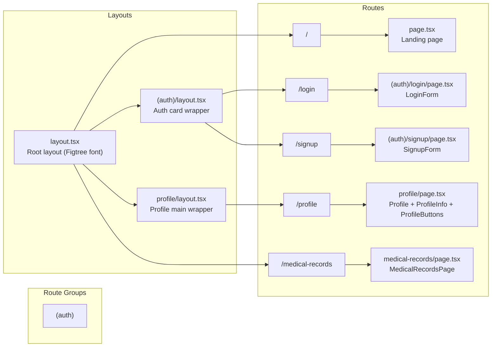
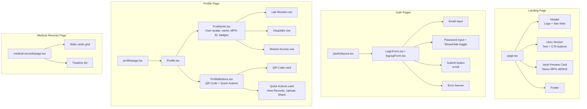
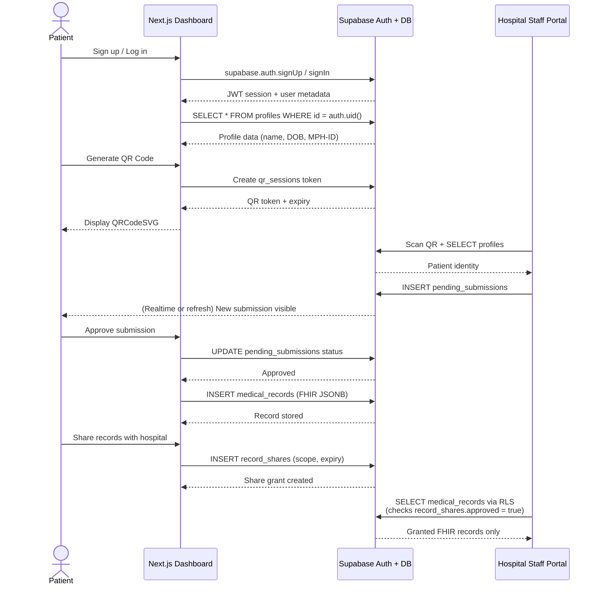
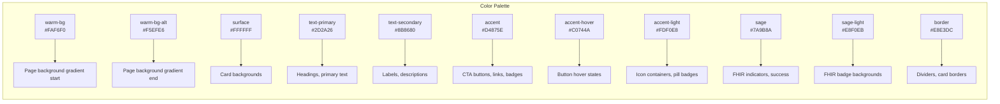
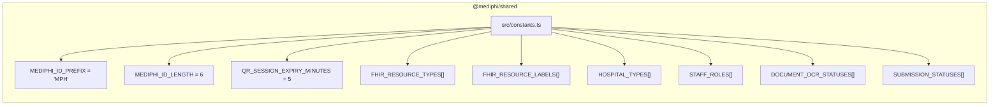
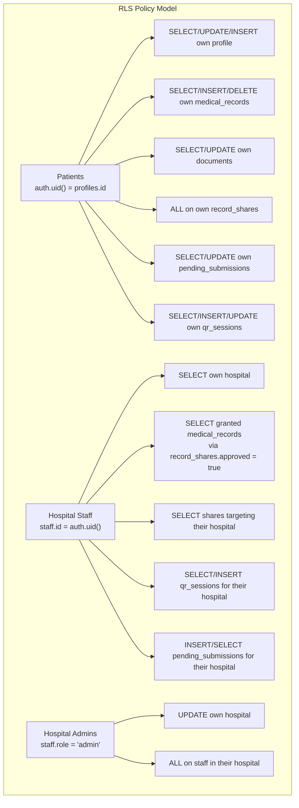

# MediPhi — Agent Context

> This file is optimized for coding agents. It contains architecture, conventions, known pitfalls, and build commands. For human contributors, see `README.md`.

---

## 1. Project Overview

MediPhi is a **medical identity vault** built on **FHIR R4**. Patients store health records, generate QR codes for instant hospital access, and control data sharing via granular permissions.

**Key features:**
- One `MPH-{id}` identity across all hospitals
- QR-code-based instant record retrieval
- Granular record sharing (time-bound, scope-limited)
- FHIR-compliant medical record storage (JSONB in Postgres)
- Document upload with OCR pipeline
- Role-based access (Patient, Doctor, Nurse, Lab Technician, Admin)

---

## 2. Architecture





---

## 3. Monorepo Structure



---

## 4. Database Schema



---

## 5. App Router Structure



---

## 6. Component Hierarchy



---

## 7. Data Flow



---

## 8. Styling & Tailwind v4 Configuration

### 8.1 Theme Tokens (`globals.css`)

All colors are defined in `@theme inline` — Tailwind v4's CSS-based config. No `tailwind.config.ts`.



### 8.2 Custom Animation Classes

| Class | Animation |
|-------|-----------|
| `.animate-fade-in` | Fade + slide up (0.6s) |
| `.animate-fade-in-left` | Fade + slide from left |
| `.animate-fade-in-right` | Fade + slide from right |
| `.animate-fade-in-scale` | Fade + scale 0.96→1 |

Usage: Add class + `style={{ opacity: 0 }}` to prevent flash before animation.

### 8.3 CRITICAL: What NOT to do in CSS

These rules were previously added and **broke the entire UI**. Never re-add them:

```css
/* ❌ NEVER — universal margin/padding reset fights Tailwind v4 Preflight */
* { box-sizing: border-box; margin: 0; padding: 0; }

/* ❌ NEVER — wildcard attribute selector overrides Tailwind utilities */
[class*="rounded-3xl"], [class*="rounded-2xl"] { overflow: hidden; }

/* ❌ NEVER — broad element selectors with deprecated word-break */
div, p, span, h1, h2, h3, h4, h5, h6, a, button, label, li, td, th {
  overflow-wrap: break-word;
  word-break: break-word;
}

/* ❌ NEVER — global button truncation without nowrap (breaks ellipsis) */
button, a[class*="bg-accent"], a[class*="bg-sage"] {
  overflow: hidden;
  text-overflow: ellipsis;
}
```

### 8.4 CSS Best Practices for this Project

1. **Use Tailwind utilities in JSX, not global CSS selectors.**
2. **Use inline `style={{ opacity: 0 }}`** only for animation initial states.
3. **Use responsive padding classes** (`px-6 md:px-12 lg:px-16`) instead of fixed `style={{ paddingLeft: '4rem' }}`.
4. **Use `whitespace-nowrap` on buttons** that must stay single-line.
5. **Use `min-w-0` on flex children** that should shrink below content width.
6. **Never use `[class*="..."]` wildcard selectors** — they override Tailwind utilities due to equal specificity + later source order.
7. **Let Tailwind v4 Preflight handle resets.** Do not add universal `* { margin: 0; padding: 0 }`.

---

## 9. Shared Constants (`@mediphi/shared`)



**FHIR Resource Labels mapping:**

| FHIR Type | UI Label |
|-----------|----------|
| `Observation` | **Lab Results** |
| `Condition` | Diagnoses |
| `MedicationStatement` | Medications |
| `Immunization` | Vaccinations |
| `DiagnosticReport` | Reports |
| `Patient` | Patient Info |

---

## 10. Row Level Security (RLS) Rules



---

## 11. File Reference

| File | Purpose | Notes |
|------|---------|-------|
| `apps/dashboard/app/globals.css` | Tailwind v4 theme + animations | **Keep minimal. No global selectors.** |
| `apps/dashboard/app/layout.tsx` | Root layout | Loads Figtree font via `next/font/google` |
| `apps/dashboard/app/page.tsx` | Landing page | Hero + vault preview card |
| `apps/dashboard/app/(auth)/layout.tsx` | Auth layout | Card wrapper for login/signup |
| `apps/dashboard/app/(auth)/login/page.tsx` | Login page | Wraps `LoginForm` |
| `apps/dashboard/app/(auth)/signup/page.tsx` | Signup page | Wraps `SignupForm` |
| `apps/dashboard/app/profile/page.tsx` | Profile page | Fetches mock user, renders `Profile` |
| `apps/dashboard/app/profile/layout.tsx` | Profile layout | Minimal wrapper |
| `apps/dashboard/app/medical-records/page.tsx` | Records timeline | Placeholder data, stats cards |
| `apps/dashboard/app/components/forms/LoginForm.tsx` | Login form | Client component with loading state |
| `apps/dashboard/app/components/forms/SignupForm.tsx` | Signup form | Client component |
| `apps/dashboard/app/components/profile/Profile.tsx` | Profile orchestrator | Combines `ProfileInfo` + `ProfileButtons` |
| `apps/dashboard/app/components/profile/ProfileInfo.tsx` | User info card | Avatar, name, MPH-ID, badges, vault rows |
| `apps/dashboard/app/components/profile/ProfileButtons.tsx` | QR + actions | `qrcode.react` for QRCodeSVG |
| `packages/shared/src/constants.ts` | Shared constants | FHIR labels, ID prefix, enums |
| `supabase/migrations/20260530000000_initial_schema.sql` | DB schema | All tables, enums, indexes, RLS policies |

---

## 12. Build Commands

```bash
# Dev server (runs via Turborepo)
cd C:\Users\pvmod\Programming\MediPhi\mediphi
npm run dev

# Production build
cd apps/dashboard
npm run build

# Or from root via Turbo
npm run build

# Lint
cd apps/dashboard
npm run lint
```

**Port:** `http://localhost:3000`

---

## 13. Known Issues & Gotchas

1. **Tailwind v4 CSS-only config:** No `tailwind.config.ts`. All theme tokens live in `globals.css` under `@theme inline`.
2. **Preflight is sacred:** Do not add global `*` resets. Preflight already handles `box-sizing` and sensible defaults.
3. **No `[class*="..."]` wildcards:** These override Tailwind utilities silently due to equal specificity + later source order.
4. **Animation opacity:** All animated elements need `style={{ opacity: 0 }}` to prevent flash before CSS animation begins.
5. **Mock user data:** `profile/page.tsx` uses a simulated `getUser()` with hardcoded `Philip Varghese Modayil`.
6. **Medical records page** uses placeholder static data, not yet connected to Supabase.
7. **Auth forms** use simulated 2s delays — not yet connected to Supabase Auth.
8. **QR sessions expire in 5 minutes** (`QR_SESSION_EXPIRY_MINUTES = 5`).

---

## 14. Environment Variables

Create `apps/dashboard/.env.local`:

```env
NEXT_PUBLIC_SUPABASE_URL=https://your-project.supabase.co
NEXT_PUBLIC_SUPABASE_ANON_KEY=your-anon-key
```

---

*Last updated: 2026-05-30*
